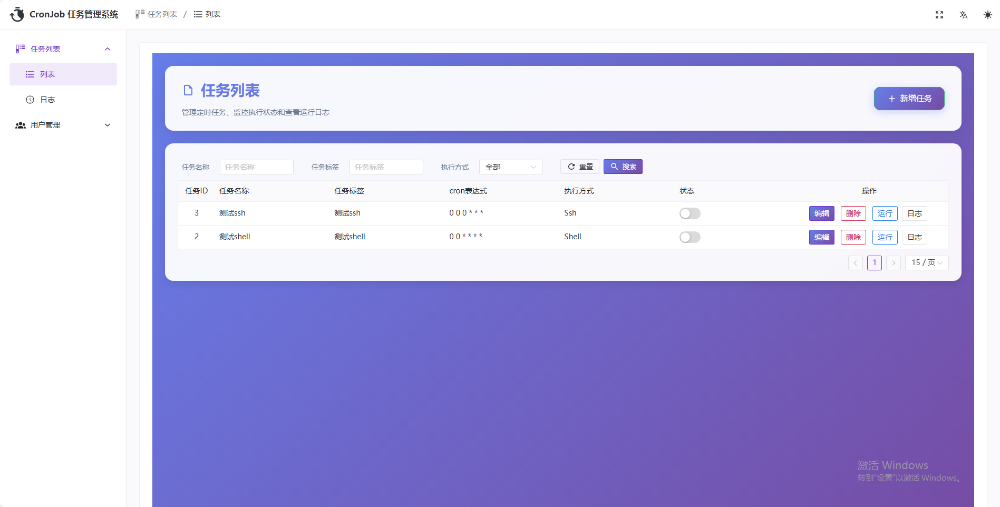
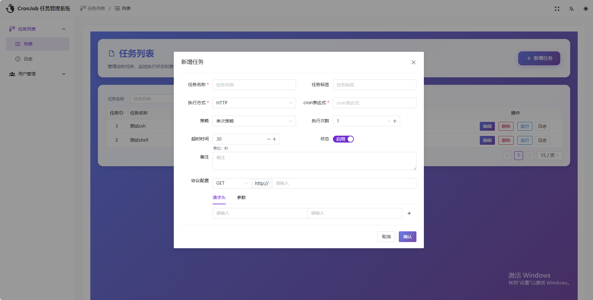
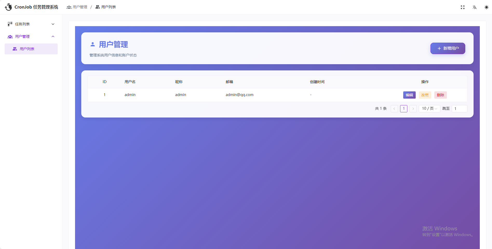
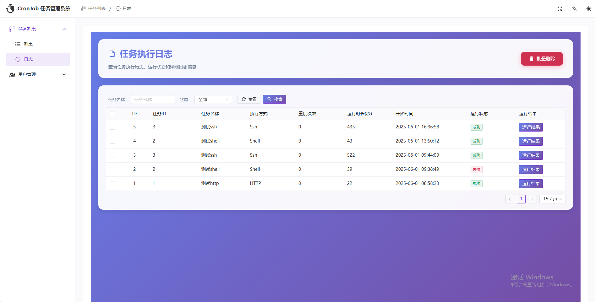
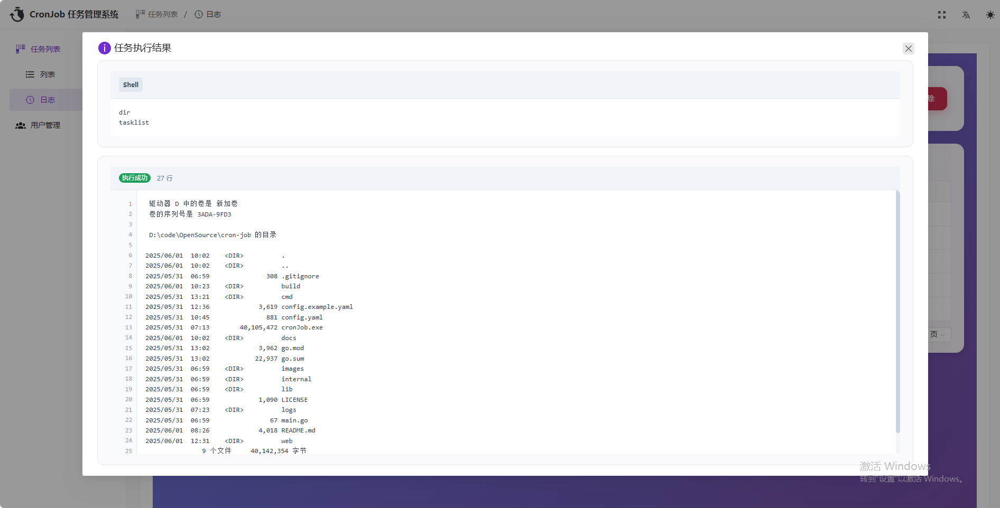

# 定时任务管理平台

基于 Golang 实现的高性能定时任务管理平台，支持秒级任务调度和分布式执行。

## ✨ 特点

- 🚀 **高性能**: 资源占用少，支持高并发任务执行
- ⏰ **秒级调度**: 支持秒级定时任务配置，精确到秒
- 📦 **部署简单**: 单二进制文件部署，仅需 YAML 配置文件
- 🎨 **管理界面**: 集成现代化前端管理页面
- 🔧 **多协议支持**: 支持 HTTP、Shell、SSH 任务类型
- 🔒 **安全可靠**: JWT 认证、CORS 配置、输入验证
- 📊 **监控完善**: 任务执行日志、状态监控、性能指标
- 🔄 **容错机制**: 任务重试、超时控制、异常恢复

# 界面












## 🚀 快速开始

### 环境要求
- Go 1.21+
- 数据库支持：
  - MySQL 5.7+ / 8.0+
  - PostgreSQL 12+
- Node.js 16+ (前端开发)

### 安装部署

1. **克隆项目**
   ```bash
   git clone <repository-url>
   cd cron-job
   ```

2. **配置数据库**

   **MySQL:**
   ```sql
   CREATE DATABASE cronJob CHARACTER SET utf8mb4 COLLATE utf8mb4_unicode_ci;
   ```

   **PostgreSQL:**
   ```sql
   CREATE DATABASE cronJob WITH ENCODING 'UTF8';
   ```

3. **配置文件**
   ```bash
   cp config.example.yaml config.yaml
   # 编辑 config.yaml 配置数据库连接等信息
   ```

   **MySQL配置示例:**
   ```yaml
   db:
     engine: "mysql"
     host: "127.0.0.1"
     port: 3306
     name: "cronJob"
     user: "root"
     password: "your_password"
   ```

   **PostgreSQL配置示例:**
   ```yaml
   db:
     engine: "postgresql"
     host: "127.0.0.1"
     port: 5432
     name: "cronJob"
     user: "postgres"
     password: "your_password"
   ```

4. **测试数据库连接**
   ```bash
   # 运行所有数据库测试
   go test ./lib/database -v

   # 或运行特定测试
   go test ./lib/database -v -run TestDatabaseConnection
   go test ./lib/database -v -run TestDatabaseFactory
   go test ./lib/database -v -run TestDatabaseConfigValidation
   ```

5. **编译运行**
   ```bash
   go mod tidy
   go build -o cronJob main.go
   ./cronJob
   ```

6. **访问系统**
   - 管理界面: http://localhost:8210/admin
   - API文档: http://localhost:8210/swagger/index.html

### Docker 部署

```dockerfile
FROM golang:1.21-alpine AS builder
WORKDIR /app
COPY . .
RUN go mod tidy && go build -o cronJob main.go

FROM alpine:latest
RUN apk --no-cache add ca-certificates tzdata
WORKDIR /root/
COPY --from=builder /app/cronJob .
COPY --from=builder /app/config.yaml .
CMD ["./cronJob"]
```

## 📖 使用指南

### 创建任务

#### HTTP任务
```json
{
  "name": "API健康检查",
  "spec": "0 */5 * * * *",
  "protocol": 1,
  "command": "{\"method\":\"GET\",\"url\":\"https://api.example.com/health\"}",
  "timeout": 30
}
```

#### Shell任务
```json
{
  "name": "数据备份",
  "spec": "0 0 2 * * *",
  "protocol": 2,
  "command": "mysqldump -u root -p database > backup.sql",
  "timeout": 3600
}
```

### Cron表达式说明
```
秒 分 时 日 月 周
*  *  *  *  *  *
```

示例：
- `0 0 12 * * *` - 每天中午12点
- `0 */5 * * * *` - 每5分钟执行
- `0 0 0 1 * *` - 每月1号零点

## 🔧 配置说明

### 核心配置
- `http.addr`: 服务监听地址
- `db.*`: 数据库连接配置
- `jwt.*`: JWT认证配置
- `cors.*`: 跨域配置

### 安全配置
- 使用环境变量存储敏感信息
- 配置CORS允许的域名
- 设置合适的JWT过期时间

## 🛡️ 安全特性

- JWT身份认证
- 输入参数验证
- SQL注入防护
- XSS攻击防护
- CORS跨域控制
- 密码强度验证

## 📊 监控指标

- 任务执行成功率
- 任务执行耗时
- 系统资源使用
- 错误日志统计

## 🔄 后续计划
- ✅ 用户管理和权限配置
- ✅ 任务执行通知模块（邮件和webhook）
- 🔄 分布式任务执行功能
- 🔄 任务依赖关系支持
- 🔄 可视化任务流程图
- 🔄 集群部署支持